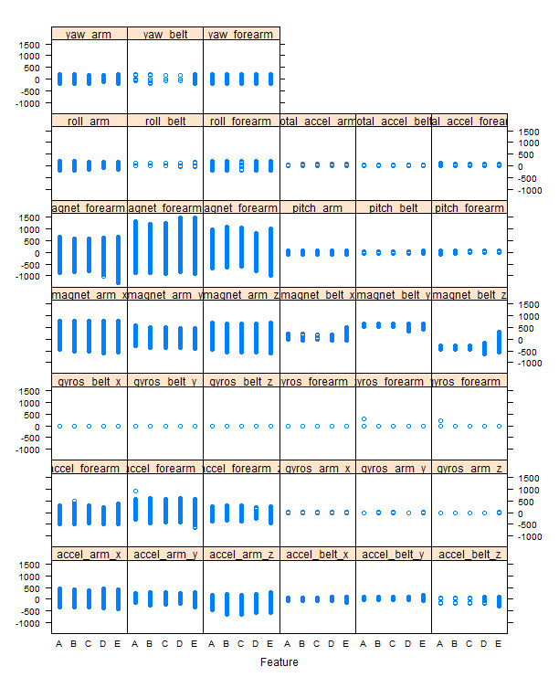
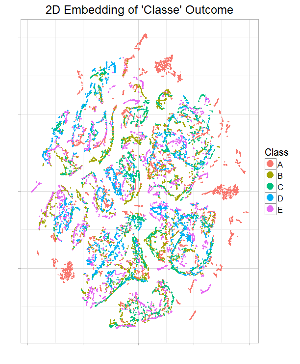
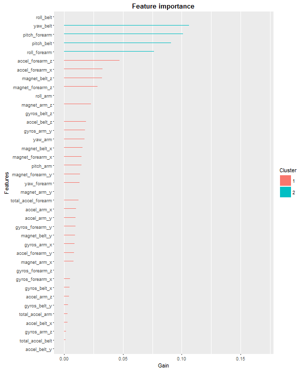

# Practical Machine Learning Project
### by Thota Sravani

# Prediction Assignment

# Background
Using devices such as **JawboneUp**, **NikeFuelBand**, and **Fitbitit** is now possible to collect a large amount of data about personal activity relatively inexpensively. These type of devices are part of the quantified self movement - a group of enthusiasts who take measurements about themselves regularly to improve their health, to find patterns in their behavior, or because they are tech geeks. One thing that people regularly do is quantify how much of a particular activity they do, but they rarely quantify how well they do it.

In this project, the goal is to use data from accelerometers on the belt, forearm, arm, and dumbell of 6 participants. They were asked to perform barbell lifts correctly and incorrectly in 5 different ways. More information is available from the website: <a href="http://groupware.les.inf.puc-rio.br/har">http://groupware.les.inf.puc-rio.br/har</a> (see the section on the Weight Lifting Exercise Dataset).

#Preparing the data
### Data Processing
<pre>
require(caret)
require(corrplot)
require(Rtsne)
require(xgboost)
require(stats)
require(knitr)
require(ggplot2)
knitr::opts_chunk$set(cache=<code></code>TRUE)
</pre>
For fast and accurate training the model, I choose **XGBoost**, an implementation of tree-based extreme gradient boosting algorithm. (As discussed in the course’s forum, this **XGBoost** tool is confirmed by course’s CTA to be allowed to be used in this assignment project.)

### Load the data
<pre>
## URL of the training and testing data
train.url ="https://d396qusza40orc.cloudfront.net/predmachlearn/pml-training.csv"
test.url = "https://d396qusza40orc.cloudfront.net/predmachlearn/pml-testing.csv"
## File names
train.name = "./data/pml-training.csv"
test.name = "./data/pml-testing.csv"
## If directory does not exist, create new
if (!file.exists("./data")) {
  dir.create("./data")
}
## If files does not exist, download the files
if (!file.exists(train.name)) {
  download.file(train.url, destfile=train.name, method="curl")
}
if (!file.exists(test.name)) {
  download.file(test.url, destfile=test.name, method="curl")
}
</pre>
### Read the Data
<pre>
## After downloading the data from the data source,We can read the two csv files into two data frames
train = read.csv("E:/Projects/Practical-Machine-Learning-Course-Project/Practical-Machine-Learning-Course-Project/pml-training.csv")
test = read.csv("E:/Projects/Practical-Machine-Learning-Course-Project/Practical-Machine-Learning-Course-Project/pml-testing.csv")
dim(train)
</pre>
<pre>
## [1] 19622   160
</pre>
<pre>
dim(test)
</pre>
<pre>
## [1]  20 160
</pre>
<pre>
names(train)
</pre>
<pre>
##   [1] "X"                        "user_name"               
##   [3] "raw_timestamp_part_1"     "raw_timestamp_part_2"    
##   [5] "cvtd_timestamp"           "new_window"              
##   [7] "num_window"               "roll_belt"               
##   [9] "pitch_belt"               "yaw_belt"                
##  [11] "total_accel_belt"         "kurtosis_roll_belt"      
##  [13] "kurtosis_picth_belt"      "kurtosis_yaw_belt"       
##  [15] "skewness_roll_belt"       "skewness_roll_belt.1"    
##  [17] "skewness_yaw_belt"        "max_roll_belt"           
##  [19] "max_picth_belt"           "max_yaw_belt"            
##  [21] "min_roll_belt"            "min_pitch_belt"          
##  [23] "min_yaw_belt"             "amplitude_roll_belt"     
##  [25] "amplitude_pitch_belt"     "amplitude_yaw_belt"      
##  [27] "var_total_accel_belt"     "avg_roll_belt"           
##  [29] "stddev_roll_belt"         "var_roll_belt"           
##  [31] "avg_pitch_belt"           "stddev_pitch_belt"       
##  [33] "var_pitch_belt"           "avg_yaw_belt"            
##  [35] "stddev_yaw_belt"          "var_yaw_belt"            
##  [37] "gyros_belt_x"             "gyros_belt_y"            
##  [39] "gyros_belt_z"             "accel_belt_x"            
##  [41] "accel_belt_y"             "accel_belt_z"            
##  [43] "magnet_belt_x"            "magnet_belt_y"           
##  [45] "magnet_belt_z"            "roll_arm"                
##  [47] "pitch_arm"                "yaw_arm"                 
##  [49] "total_accel_arm"          "var_accel_arm"           
##  [51] "avg_roll_arm"             "stddev_roll_arm"         
##  [53] "var_roll_arm"             "avg_pitch_arm"           
##  [55] "stddev_pitch_arm"         "var_pitch_arm"           
##  [57] "avg_yaw_arm"              "stddev_yaw_arm"          
##  [59] "var_yaw_arm"              "gyros_arm_x"             
##  [61] "gyros_arm_y"              "gyros_arm_z"             
##  [63] "accel_arm_x"              "accel_arm_y"             
##  [65] "accel_arm_z"              "magnet_arm_x"            
##  [67] "magnet_arm_y"             "magnet_arm_z"            
##  [69] "kurtosis_roll_arm"        "kurtosis_picth_arm"      
##  [71] "kurtosis_yaw_arm"         "skewness_roll_arm"       
##  [73] "skewness_pitch_arm"       "skewness_yaw_arm"        
##  [75] "max_roll_arm"             "max_picth_arm"           
##  [77] "max_yaw_arm"              "min_roll_arm"            
##  [79] "min_pitch_arm"            "min_yaw_arm"             
##  [81] "amplitude_roll_arm"       "amplitude_pitch_arm"     
##  [83] "amplitude_yaw_arm"        "roll_dumbbell"           
##  [85] "pitch_dumbbell"           "yaw_dumbbell"            
##  [87] "kurtosis_roll_dumbbell"   "kurtosis_picth_dumbbell" 
##  [89] "kurtosis_yaw_dumbbell"    "skewness_roll_dumbbell"  
##  [91] "skewness_pitch_dumbbell"  "skewness_yaw_dumbbell"   
##  [93] "max_roll_dumbbell"        "max_picth_dumbbell"      
##  [95] "max_yaw_dumbbell"         "min_roll_dumbbell"       
##  [97] "min_pitch_dumbbell"       "min_yaw_dumbbell"        
##  [99] "amplitude_roll_dumbbell"  "amplitude_pitch_dumbbell"
## [101] "amplitude_yaw_dumbbell"   "total_accel_dumbbell"    
## [103] "var_accel_dumbbell"       "avg_roll_dumbbell"       
## [105] "stddev_roll_dumbbell"     "var_roll_dumbbell"       
## [107] "avg_pitch_dumbbell"       "stddev_pitch_dumbbell"   
## [109] "var_pitch_dumbbell"       "avg_yaw_dumbbell"        
## [111] "stddev_yaw_dumbbell"      "var_yaw_dumbbell"        
## [113] "gyros_dumbbell_x"         "gyros_dumbbell_y"        
## [115] "gyros_dumbbell_z"         "accel_dumbbell_x"        
## [117] "accel_dumbbell_y"         "accel_dumbbell_z"        
## [119] "magnet_dumbbell_x"        "magnet_dumbbell_y"       
## [121] "magnet_dumbbell_z"        "roll_forearm"            
## [123] "pitch_forearm"            "yaw_forearm"             
## [125] "kurtosis_roll_forearm"    "kurtosis_picth_forearm"  
## [127] "kurtosis_yaw_forearm"     "skewness_roll_forearm"   
## [129] "skewness_pitch_forearm"   "skewness_yaw_forearm"    
## [131] "max_roll_forearm"         "max_picth_forearm"       
## [133] "max_yaw_forearm"          "min_roll_forearm"        
## [135] "min_pitch_forearm"        "min_yaw_forearm"         
## [137] "amplitude_roll_forearm"   "amplitude_pitch_forearm" 
## [139] "amplitude_yaw_forearm"    "total_accel_forearm"     
## [141] "var_accel_forearm"        "avg_roll_forearm"        
## [143] "stddev_roll_forearm"      "var_roll_forearm"        
## [145] "avg_pitch_forearm"        "stddev_pitch_forearm"    
## [147] "var_pitch_forearm"        "avg_yaw_forearm"         
## [149] "stddev_yaw_forearm"       "var_yaw_forearm"         
## [151] "gyros_forearm_x"          "gyros_forearm_y"         
## [153] "gyros_forearm_z"          "accel_forearm_x"         
## [155] "accel_forearm_y"          "accel_forearm_z"         
## [157] "magnet_forearm_x"         "magnet_forearm_y"        
## [159] "magnet_forearm_z"         "classe"

</pre>
The raw training data has 19622 rows of observations and 158 features (predictors). Column <code>X</code> is unusable row number. While the testing data has 20 rows and the same 158 features. There is one column of target outcome named <code>classe</code>.

### Clean the data

First, extract target outcome (the activity quality) from training data, so now the training data contains only the predictors (the activity monitors).
<pre>
##Target outcome (label)
outcome.org = train[, "classe"]
outcome = outcome.org 
levels(outcome)
</pre>
<pre>
## [1] "A" "B" "C" "D" "E"
</pre>
Outcome has 5 levels in character format.
Convert the outcome to numeric, because **XGBoost** gradient booster only recognizes numeric data.
<pre>
## Convert character levels to numeric
num.class = length(levels(outcome))
levels(outcome) = 1:num.class
head(outcome)
</pre>
<pre>
## [1] 1 1 1 1 1 1
## Levels: 1 2 3 4 5
</pre>
The outcome is removed from training data.
<pre>
## Remove outcome from train
train$classe = NULL
</pre>
The assignment rubric asks to use data from accelerometers on the **belt**, **forearm**, **arm**, and **dumbell**, so the features are extracted based on these keywords.
<pre>
## Filter columns on: belt, forearm, arm, dumbell
filter = grepl("belt|arm|dumbell", names(train))
train = train[, filter]
test = test[, filter]
</pre>

Instead of less-accurate imputation of missing data, remove all columns with **NA** values.
<pre>
## Remove columns with NA, use test data as referal for NA
cols.without.na = colSums(is.na(test)) == 0
train = train[, cols.without.na]
test = test[, cols.without.na]
</pre>

# Preprocessing

### Check for features’s variance

Based on the principal component analysis **PCA**, it is important that features have maximum variance for maximum uniqueness, so that each feature is as distant as possible (as orthogonal as possible) from the other features.
<pre>
## Check for zero variance
zero.var = nearZeroVar(train, saveMetrics=TRUE)
zero.var
</pre>
<pre>
##                     freqRatio percentUnique zeroVar   nzv
## roll_belt            1.101904     6.7781062   FALSE FALSE
## pitch_belt           1.036082     9.3772296   FALSE FALSE
## yaw_belt             1.058480     9.9734991   FALSE FALSE
## total_accel_belt     1.063160     0.1477933   FALSE FALSE
## gyros_belt_x         1.058651     0.7134849   FALSE FALSE
## gyros_belt_y         1.144000     0.3516461   FALSE FALSE
## gyros_belt_z         1.066214     0.8612782   FALSE FALSE
## accel_belt_x         1.055412     0.8357966   FALSE FALSE
## accel_belt_y         1.113725     0.7287738   FALSE FALSE
## accel_belt_z         1.078767     1.5237998   FALSE FALSE
## magnet_belt_x        1.090141     1.6664968   FALSE FALSE
## magnet_belt_y        1.099688     1.5187035   FALSE FALSE
## magnet_belt_z        1.006369     2.3290184   FALSE FALSE
## roll_arm            52.338462    13.5256345   FALSE FALSE
## pitch_arm           87.256410    15.7323412   FALSE FALSE
## yaw_arm             33.029126    14.6570176   FALSE FALSE
## total_accel_arm      1.024526     0.3363572   FALSE FALSE
## gyros_arm_x          1.015504     3.2769341   FALSE FALSE
## gyros_arm_y          1.454369     1.9162165   FALSE FALSE
## gyros_arm_z          1.110687     1.2638875   FALSE FALSE
## accel_arm_x          1.017341     3.9598410   FALSE FALSE
## accel_arm_y          1.140187     2.7367241   FALSE FALSE
## accel_arm_z          1.128000     4.0362858   FALSE FALSE
## magnet_arm_x         1.000000     6.8239731   FALSE FALSE
## magnet_arm_y         1.056818     4.4439914   FALSE FALSE
## magnet_arm_z         1.036364     6.4468454   FALSE FALSE
## roll_forearm        11.589286    11.0895933   FALSE FALSE
## pitch_forearm       65.983051    14.8557741   FALSE FALSE
## yaw_forearm         15.322835    10.1467740   FALSE FALSE
## total_accel_forearm  1.128928     0.3567424   FALSE FALSE
## gyros_forearm_x      1.059273     1.5187035   FALSE FALSE
## gyros_forearm_y      1.036554     3.7763735   FALSE FALSE
## gyros_forearm_z      1.122917     1.5645704   FALSE FALSE
## accel_forearm_x      1.126437     4.0464784   FALSE FALSE
## accel_forearm_y      1.059406     5.1116094   FALSE FALSE
## accel_forearm_z      1.006250     2.9558659   FALSE FALSE
## magnet_forearm_x     1.012346     7.7667924   FALSE FALSE
## magnet_forearm_y     1.246914     9.5403119   FALSE FALSE
## magnet_forearm_z     1.000000     8.5771073   FALSE FALSE
</pre>

There is no features without variability (all has enough variance). So there is no feature to be removed further.

### Plot of relationship between features and outcome

Plot the relationship between features and outcome. From the plot below, each features has relatively the same distribution among the 5 outcome levels (A, B, C, D, E).
<pre>
featurePlot(train, outcome.org, <code>"strip"</code>)
</pre>

### Plot of correlation matrix

Plot a correlation matrix between features.

A good set of features is when they are highly uncorrelated **(orthogonal)** each others. The plot below shows average of correlation is not too high, so I choose to not perform further **PCA preprocessing**.
<pre>
corrplot.mixed(cor(train), lower="circle", upper="color", 
               tl.pos="lt", diag="n", order="hclust", hclust.method="complete")
</pre>

### tSNE plot

A tSNE **(t-Distributed Stochastic Neighbor Embedding)** visualization is 2D plot of multidimensional features, that is multidimensional reduction into 2D plane. In the tSNE plot below there is no clear separation of clustering of the 5 levels of outcome (A, B, C, D, E). So it hardly gets conclusion for manually building any regression equation from the irregularity.
<pre>
## t-Distributed Stochastic Neighbor Embedding
tsne = Rtsne(as.matrix(train), check_duplicates=FALSE, pca=TRUE, 
              perplexity=30, theta=0.5, dims=2)
</pre>
<pre>
## Read the 19622 x 39 data matrix successfully!
## Using no_dims = 2, perplexity = 30.000000, and theta = 0.500000
## Computing input similarities...
## Building tree...
##  - point 0 of 19622
##  - point 10000 of 19622
## Done in 5.90 seconds (sparsity = 0.005774)!
## Learning embedding...
## Iteration 50: error is 106.633840 (50 iterations in 9.74 seconds)
## Iteration 100: error is 97.718591 (50 iterations in 10.70 seconds)
## Iteration 150: error is 82.962726 (50 iterations in 7.74 seconds)
## Iteration 200: error is 78.169002 (50 iterations in 7.45 seconds)
## Iteration 250: error is 3.803975 (50 iterations in 7.43 seconds)
## Iteration 300: error is 3.086925 (50 iterations in 7.28 seconds)
## Iteration 350: error is 2.675746 (50 iterations in 7.20 seconds)
## Iteration 400: error is 2.385472 (50 iterations in 7.20 seconds)
## Iteration 450: error is 2.168501 (50 iterations in 7.13 seconds)
## Iteration 500: error is 2.000504 (50 iterations in 7.15 seconds)
## Iteration 550: error is 1.866260 (50 iterations in 7.15 seconds)
## Iteration 600: error is 1.755478 (50 iterations in 7.16 seconds)
## Iteration 650: error is 1.662327 (50 iterations in 7.18 seconds)
## Iteration 700: error is 1.583451 (50 iterations in 7.21 seconds)
## Iteration 750: error is 1.515918 (50 iterations in 7.22 seconds)
## Iteration 800: error is 1.458107 (50 iterations in 7.28 seconds)
## Iteration 850: error is 1.407774 (50 iterations in 7.28 seconds)
## Iteration 900: error is 1.363542 (50 iterations in 7.31 seconds)
## Iteration 950: error is 1.324365 (50 iterations in 7.39 seconds)
## Iteration 999: error is 1.290877 (50 iterations in 7.23 seconds)
## Fitting performed in 151.42 seconds.
</pre>
<pre>
embedding = as.data.frame(tsne$Y)
embedding$Class = outcome.org
s = ggplot(embedding, aes(x=V1, y=V2, color=Class)) +
  geom_point(size=1.25) +
  guides(colour=guide_legend(override.aes=list(size=6))) +
  xlab("") + ylab("") +
  ggtitle("2D Embedding of 'Classe' Outcome") +
  theme_light(base_size=20) +
  theme(axis.text.x=element_blank(),
        axis.text.y=element_blank())
print(s)
</pre>

# Build machine learning model

Now build a machine learning model to predict activity quality (**classe** outcome) from the activity monitors (the features or predictors) by using **XGBoost** extreme gradient boosting algorithm.

###**XGBoost Data**

**XGBoost** supports only numeric matrix data. Converting all training, testing and outcome data to matrix.
<pre>
## Convert data to matrix
train.matrix = as.matrix(train)
mode(train.matrix) = "numeric"
test.matrix = as.matrix(test)
mode(test.matrix) = "numeric"
## Convert outcome from factor to numeric matrix 
## xgboost takes multi-labels in [0, numOfClass)
y = as.matrix(as.integer(outcome)-1)
</pre>

### **XGBoost Parameters**

* Set **XGBoost** parameters for cross validation and training.
* Set a **multiclass** classification objective as the gradient boosting’s learning function.
* Set evaluation metric to **merror**, **multiclass** error rate.
<pre>
## xgboost parameters
param <- list("objective" = "multi:softprob",    # multiclass classification 
              "num_class" = num.class,    # number of classes 
              "eval_metric" = "merror",    # evaluation metric 
              "nthread" = 8,   # number of threads to be used 
              "max_depth" = 16,    # maximum depth of tree 
              "eta" = 0.3,    # step size shrinkage 
              "gamma" = 0,    # minimum loss reduction 
              "subsample" = 1,    # part of data instances to grow tree 
              "colsample_bytree" = 1,  # subsample ratio of columns when constructing each tree 
              "min_child_weight" = 12  # minimum sum of instance weight needed in a child 
              )
</pre>
###**Expected error rate**

Expected error rate is less than **1%** for a good classification. Do cross validation to estimate the error rate using 4-fold cross validation, with 200 epochs to reach the expected error rate of less than **1%**.

### 4-fold cross validation
<pre>
## Set random seed, for reproducibility 
set.seed(1234)
## k-fold cross validation, with timing
nround.cv = 200
system.time( bst.cv <- xgb.cv(param=param, data=train.matrix, label=y, 
              nfold=4, nrounds=nround.cv, prediction=TRUE, verbose=FALSE) )
</pre>
<pre>
##    user  system elapsed 
##  266.87   15.02  149.65
</pre>
Elapsed time is around 150 seconds (2.5 minutes).
<pre>
tail(bst.cv$dt) 
</pre>
<pre>
##    train.merror.mean train.merror.std test.merror.mean test.merror.std
## 1:                 0                0         0.006013        0.000947
## 2:                 0                0         0.006013        0.000947
## 3:                 0                0         0.006115        0.001164
## 4:                 0                0         0.006064        0.001095
## 5:                 0                0         0.006115        0.001140
## 6:                 0                0         0.006166        0.001180
</pre>

From the cross validation, choose index with minimum multiclass error rate.
Index will be used in the model training to fulfill expected minimum error rate of **< 1%**.
<pre>
## Index of minimum merror
min.merror.idx = which.min(bst.cv$dt[, test.merror.mean]) 
min.merror.idx 
</pre>
<pre>
## [1] 106
</pre>
<pre>
## Minimum merror
bst.cv$dt[min.merror.idx,]
</pre>
<pre>
##    train.merror.mean train.merror.std test.merror.mean test.merror.std
## 1:                 0                0         0.005962        0.001107
</pre>

Best cross-validation’s minimum error rate **test.merror.mean** is around 0.006 (0.6%), happened at 106th iteration.

### Confusion matrix

Tabulates the cross-validation’s predictions of the model against the truths.
<pre>
## Get CV's prediction decoding
pred.cv = matrix(bst.cv$pred, nrow=length(bst.cv$pred)/num.class, ncol=num.class)
pred.cv = max.col(pred.cv, "last")
## Confusion matrix
confusionMatrix(factor(y+1), factor(pred.cv))
</pre>
<pre>
## Confusion Matrix and Statistics
## 
##           Reference
## Prediction    1    2    3    4    5
##          1 5567    8    5    0    0
##          2   12 3770   15    0    0
##          3    0   24 3382   16    0
##          4    2    0   23 3190    1
##          5    0    2    3   10 3592
## 
## Overall Statistics
##                                           
##                Accuracy : 0.9938          
##                  95% CI : (0.9926, 0.9949)
##     No Information Rate : 0.2844          
##     P-Value [Acc > NIR] : < 2.2e-16       
##                                           
##                   Kappa : 0.9922          
##  Mcnemar's Test P-Value : NA              
## 
## Statistics by Class:
## 
##                      Class: 1 Class: 2 Class: 3 Class: 4 Class: 5
## Sensitivity            0.9975   0.9911   0.9866   0.9919   0.9997
## Specificity            0.9991   0.9983   0.9975   0.9984   0.9991
## Pos Pred Value         0.9977   0.9929   0.9883   0.9919   0.9958
## Neg Pred Value         0.9990   0.9979   0.9972   0.9984   0.9999
## Prevalence             0.2844   0.1939   0.1747   0.1639   0.1831
## Detection Rate         0.2837   0.1921   0.1724   0.1626   0.1831
## Detection Prevalence   0.2844   0.1935   0.1744   0.1639   0.1838
## Balanced Accuracy      0.9983   0.9947   0.9921   0.9952   0.9994
</pre>

* Confusion matrix shows concentration of correct predictions is on the diagonal, as expected.

* The average accuracy is **99.38%**, with error rate is **0.62%**. So, expected error rate of less than **1%** is fulfilled.

### Model training

Fit the XGBoost gradient boosting model on all of the training data.
<pre>
## Real model fit training, with full data
system.time( bst <- xgboost(param=param, data=train.matrix, label=y, 
                           nrounds=min.merror.idx, verbose=0) )
</pre>
<pre>
##    user  system elapsed 
##   56.92    2.78   35.05
</pre>

Time elapsed is around 35 seconds.

### Predicting the testing data
<pre>
## xgboost predict test data using the trained model
pred <- predict(bst, test.matrix)  
head(pred, 10)
</pre>
<pre>  
##  [1] 4.610718e-04 9.972614e-01 1.705230e-03 2.652793e-04 3.069591e-04
##  [6] 9.986942e-01 8.453168e-04 4.312960e-04 8.232127e-06 2.090017e-05
</pre>

### Post-Processing

* Output of prediction is the predicted probability of the 5 levels (columns) of outcome.
* Decode the quantitative 5 levels of outcomes to qualitative letters (A, B, C, D, E).
<pre>
## Decode prediction
pred = matrix(pred, nrow=num.class, ncol=length(pred)/num.class)
pred = t(pred)
pred = max.col(pred, "last")
pred.char = toupper(letters[pred])
</pre>
(The prediction result **pred.char** is not displayed intentionally due to Honour Code, because it is the answer of the “project submission” part.)

# Feature importance
<pre>
## Get the trained model
model = xgb.dump(bst, with.stats=TRUE)
## Get the feature real names
names = dimnames(train.matrix)[[2]]
## Compute feature importance matrix
importance_matrix = xgb.importance(names, model=bst)
# Plot
t = xgb.plot.importance(importance_matrix)
print(t) 
</pre>

Feature importance plot is useful to select only best features with highest correlation to the outcome(s). To improve model fitting performance (time or overfitting), less important features can be removed.

# Creating submission files
<pre>
path = "./answer"
pml_write_files = function(x) {
    n = length(x)
    for(i in 1: n) {
        filename = paste0("problem_id_", i, ".txt")
        write.table(x[i], file=file.path(path, filename), 
                    quote=FALSE, row.names=FALSE, col.names=FALSE)
    }
}
pml_write_files(pred.char)
</pre>
